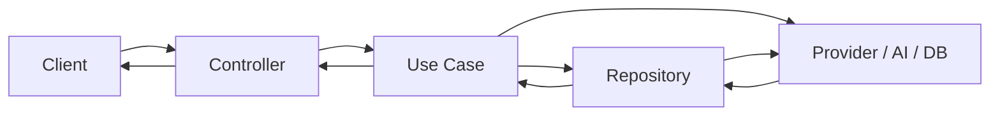

# Architecture

The Product Optimizer Platform is a full-stack application: a **backend** following Clean Architecture (Express + TypeScript) and a **frontend** React SPA with auth context and hash-based routing.

## Overview

- **Backend**: Layered (Domain → Application → Infrastructure → Presentation). Use cases orchestrate business logic; repositories and external services are abstracted behind interfaces.
- **Frontend**: Single-page app with login, role-based navigation (Administrator vs Operator), and pages for submissions, providers, products, users (admin), jobs (admin), and profile.
- **Data flow**: HTTP request → Controller → Use case → Repository / Provider / AI client → Response.

---

## Backend Layers

### Domain (`backend/src/domain/`)

Business entities and interfaces; no framework or I/O.

- **Entities**: `Submission` / `SubmissionEntity`, `Product` / `ProductEntity`, `NormalizedProduct` / `NormalizedProductEntity`, `PipelineRun`, `User` (with `UserRole`: `administrator` | `manager` | `operator`).
- **Providers**: `IProvider` (sync/fetch from external catalog), `ProviderSource`.
- **AI**: `IChatCompletionClient` (for product enhancement).

### Application (`backend/src/application/usecases/`)

Use cases implement business operations and depend on domain types and repository/provider interfaces (injected). For a full list with inputs, outputs, and dependencies, see [Use Cases](usecases/README.md) (one file per use case in `docs/usecases/`).

- **Auth**: `LoginUseCase`, `GetMeUseCase`, `UpdateProfileUseCase`.
- **Submission**: `CreateSubmissionUseCase`, `GetAllSubmissionsUseCase`, `GetSubmissionByIdUseCase`, `UpdateSubmissionUseCase`.
- **Provider**: `GetProvidersUseCase`, `SyncProviderUseCase`, `ProcessProductsUseCase`, `NormalizeProductsUseCase`.
- **Product**: `EnhanceProductUseCase`.
- **Job**: `TriggerImportJobUseCase`, `TriggerEnrichJobUseCase`, `ListPipelineRunsUseCase`, `GetPipelineRunByIdUseCase`, `ListFailedProductsUseCase`, `RetryFailedProductsUseCase`.
- **User**: `GetAllUsersUseCase`, `CreateUserUseCase`.

### Infrastructure (`backend/src/infrastructure/`)

Concrete implementations and side effects.

- **Database**: `databaseClient`, migrations (`migrations/*.sql`), `runMigrations`, `seedAdmin`.
- **Repositories**: Factory in `repositories/repositoryFactory.ts` chooses implementations by `STORAGE_DRIVER` (file vs database) for submissions, products, providers; e.g. `DatabaseSubmissionRepository`, `DatabaseProductRepository`, `DatabaseProviderRepository`, file-based alternatives where applicable.
- **Providers**: `EasyGiftsProvider` (uses `EASYGIFTS_API_URL`), `HttpClient`.
- **AI**: `aiClientFactory` (DeepInfra implementation of `IChatCompletionClient`).
- **Jobs**: `importJob`, `enrichJob`, `jobRunner`, `scheduler` (cron for import/enrich).
- **Web**: Express app in `web/server.ts`, `authMiddleware`, role check (`requireRole`), CORS, JSON body parsing.

### Presentation (`backend/src/presentation/`)

HTTP surface: controllers and request/response DTOs.

- **Controllers**: `authController`, `formController` (submissions), `providerController`, `productController`, `userController`, `jobController`.
- **Auth**: Routes under `/api`; auth middleware applied to all except `/api/auth/login`; `userRouter` and job router use `requireRole('administrator')` for admin-only endpoints.

---

## Frontend Structure

- **Entry**: `main.tsx` → `App.tsx` with `AuthProvider` and `AppContent`.
- **Auth**: `contexts/AuthContext.tsx` – login state, token, user, role; token sent to backend in API calls.
- **Pages**: `HomePage`, `SubmissionsPage`, `ProvidersPage`, `ProductsPage`, `ProductEditPage`, `UsersPage`, `JobsPage`, `ProfilePage`, `LoginPage`.
- **Routing**: Hash-based (`#submissions`, `#providers`, `#products`, `#users`, `#jobs`, `#profile`, `#products/edit/:providerId/:id`). Page visibility depends on role.
- **Components**: `Layout` (nav + content), `Form`, `SubmissionList` / `SubmissionItem`.
- **Services**: `services/api.ts` – HTTP client and API methods (base URL from env or default).
- **Types**: `domain/entities/` (e.g. `User`, `Submission`, `Product`), `presentation/requests/`, `presentation/responses/` aligned with backend DTOs.

---

## Roles and Access

- **Administrator** (`role: 'administrator'`): Full access – submissions, providers, products, users (list/create), jobs (trigger import/enrich, list runs, failed products, retry). Sees Users and Jobs in the UI.
- **Operator** (`role: 'operator'`): No access to Providers, Users, or Jobs. Can use submissions, products, and profile. Operators do not see the Providers, Users, or Jobs navigation.
- **Manager** (`role: 'manager'`): Same as operator in the current implementation; can be extended later.

API enforcement: admin-only routes (`GET/POST /api/users`, all `/api/admin/jobs/*`) use `requireRole('administrator')`; other protected routes only require a valid JWT.

For a concise summary of roles and background jobs, see [Roles](ROLES.md) and [Jobs](JOBS.md).
